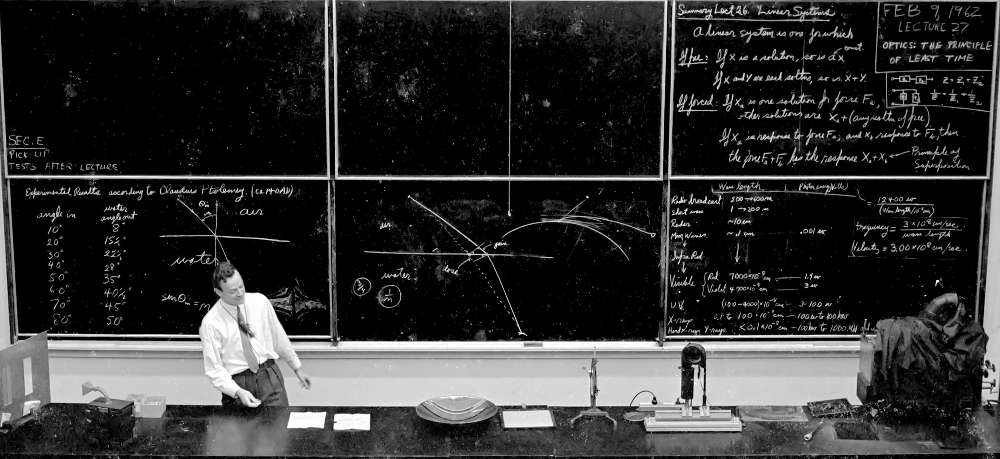

<!--
**sameerdev7/sameerdev7** is a ✨ _special_ ✨ repository because its `README.md` (this file) appears on your GitHub profile.

Here are some ideas to get you started:

- 🔭 I’m currently working on ...
- 🌱 I’m currently learning ...
- 👯 I’m looking to collaborate on ...
- 🤔 I’m looking for help with ...
- 💬 Ask me about ...
- 📫 How to reach me: ...
- 😄 Pronouns: ...
- ⚡ Fun fact: ...
-->

# Hi, I'm Sameer

- Interested in AI/ML Research, Software Engineering, building AI tools, and design production-ready systems.

## Projects 

- **[ThinkbookLM](https://github.com/sameerdev7/Thinkbook-LM):** A Notebook-LM clone with citation first RAG Architecture for multi-format document processing
- **[TransformerLM](https://github.com/sameerdev7/TransformerLM):** A decoder-only Transformer language model trained from scratch.
- **[TextToSQL](https://github.com/sameerdev7/TextToSQL):** Fine-tuned Phi-3.5 Mini Instruct for Text-to-SQL and deployed a quantized llama.cpp inference pipeline with FastAPI and Streamlit.
- **[From LR-Transformers](https://github.com/sameerdev7/From-LR-Transformers):** Collection of Deep Learning Paper Implementations.

## Tech Stack 

- **Languages:** Python, C/C++, Javascript, Typescript
- **AI/ML:** PyTorch, Transformers, HuggingFace, ScikitLearn
- **Backend:** FastAPI, PostgresQL, Docker, MySQL
- **Frontend:** React, Tailwind

